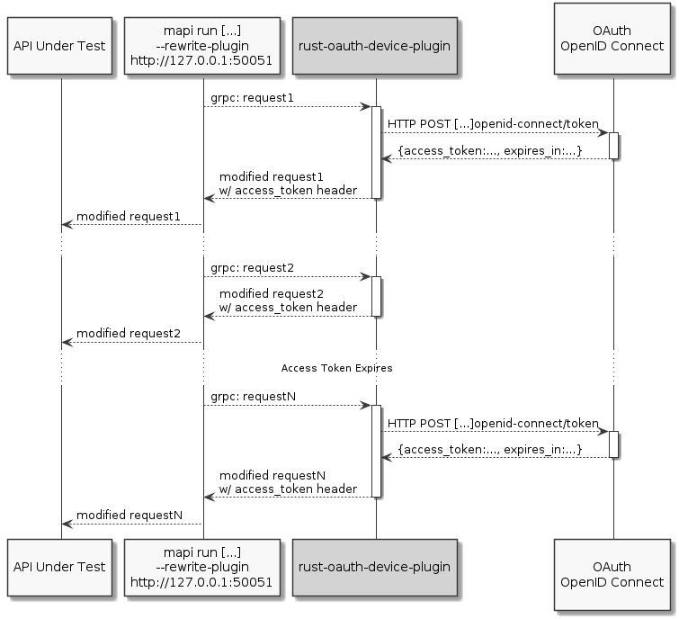

This rust plugin example injects an authorization header
retreived from an [OAuth OpenID Connect access token endpoint.](https://openid.net/specs/openid-connect-core-1_0.html#rfc.section.3.1.3)




# Compiling

## Prerequisites

* [rust 1.60 or higher](https://www.rust-lang.org/)
* [`tonic` dependencies](https://github.com/hyperium/tonic#dependencies)
* [`mapi` CLI 2.7.6 or higher](https://mayhem4api.forallsecure.com/docs/ch01-01-installation.html)
* [`grpcurl`(Optional)](https://github.com/fullstorydev/grpcurl#installation)


## Build

In the directory of this readme, run:

```rust
cargo build
```

The binary will be in `./target/debug/rust-openid-token-plugin`


# Usage

## Usage Prerequisites

To use this plugin, you'll need a method to retreive an
`access_token` from your OAuth OpenID Connect [`token` endpoint.](https://openid.net/specs/openid-connect-core-1_0.html#rfc.section.3.1.3)

Consult the documentation for your oauth provider. You may be
able to use:
 * [offline access](https://openid.net/specs/openid-connect-core-1_0.html#rfc.section.11),
 * a password authentication flow
 * an application
 * or any other mechanism your OAuth provider supplies for the `/token` endpoint


### `curl` Testing

Once you've determined how you're going to retreive the access token,
construct a [`curl`](https://curl.se/download.html) command that
returns an access token.

#### Example 1: `offline_access`

Using [device flow](https://oauth.net/2/device-flow/), a valid openid-connect request
may look something like:

```shell
curl -vvv http://localhost:8080/auth/protocol/openid-connect/token" \
  --data-urlencode "grant_type=pasword" \
  --data-urlencode "scope=openid offline_access" \
  --data-urlencode 'client_id=MY_CLIENT' \
  --data-urlencode "client_secret=MY_CLIENT_SECRET" \
  --data-urlencode "username=USER" \
  --data-urlencode "password=USER_PASSWORD"

```

*You'll need to change all the `SCREAMING_SNAKE_CASE` variables to the particulars
of your OAuth system.*


#### Example 2: `client_credentials`

To simply use the authentication client's credentials, the `curl` command may
look something like the following

```shell
curl http://localhost:8080/auth/openid-connect/token" \
  --data-urlencode 'grant_type=client_credentials' \
  --data-urlencode 'client_id=MY_CLIENT' \
  --data-urlencode 'client_secret=MY_CLIENT_SECRET'
```

*You'll need to change all the `SCREAMING_SNAKE_CASE` variables to the particulars
of your OAuth system.*

## Starting Plugin

With the `curl` command from the [previous step](#curl-testing), directly copy all
`--data-urlencode` and specify your endpoint to the `rust-oauth-device-plugin`
like.

*Take care to specify `--api-under-test-header-prefix` if you need it!
Otherwise the plugin will simply pass the bare token as the header value.*

```shell
rust-openid-token-plugin \
  --api-under-test-header-prefix "Bearer " \
  --oauth-token-url http://localhost:8080/auth/protocol/openid-connect/token" \
  --data-urlencode "grant_type=pasword" \
  --data-urlencode "scope=openid offline_access" \
  --data-urlencode 'client_id=MY_CLIENT' \
  --data-urlencode "client_secret=MY_CLIENT_SECRET" \
  --data-urlencode "username=USER" \
  --data-urlencode "password=USER_PASSWORD"
```

Test this rewrite server with the following [`gpcurl`](https://github.com/fullstorydev/grpcurl#installation)
line:
```shell
grpcurl \
    -plaintext  \
    -proto request-rewrite-plugin.proto \
    -d '{"url": "http://example.com", "headers":[], "body":"body"}' \
    '[::]:50051' \
    mapi.rewrite.RewritePlugin/Rewrite
```

If successful, the response will look something like the following with base64-encoded values for the injected header:

```json
{
  "url": "http://example.com",
  "headers": [
    {
      "name": "YXV0aG9yaXphdGlvbg==",
      "value": "ZXlKaGJHY2lPaUpTVXpJMU5pSXNJblI1Y0NJZ09pQWlTbGRVSWl3aWEybGtJaUE2SUNJMlptdHRUVVUxYVhoM1lWbDFNVUpvZDBKNlJ6aFNabkpHTTFnelVubENiMWs1Wnpsa1dUSjRRbFJySW4wLmV5SmxlSEFpT2pFMk5qazNOVE0wTURrc0ltbGhkQ0k2TVRZMk9UYzFNekV3T1N3aWFuUnBJam9pWlRVM1ltTmlOMk10WmpRNE5TMDBPRFk1TFdFeVpHRXROR015TVRoa09HUXpaalUwSWl3aWFYTnpJam9pYUhSMGNEb3ZMMnh2WTJGc2FHOXpkRG80TURjNUwyRjFkR2d2Y21WaGJHMXpMMjFoZVdobGJTSXNJbUYxWkNJNkltRmpZMjkxYm5RaUxDSnpkV0lpT2lJeU9HUmpabVJtTkMwNU5tSTVMVFEzTVRNdE9EZG1PUzFpTUdFM05qVTNNbVEwTTJRaUxDSjBlWEFpT2lKQ1pXRnlaWElpTENKaGVuQWlPaUp0WVhCcExXRndhU0lzSW5ObGMzTnBiMjVmYzNSaGRHVWlPaUpsTkdKbU1tSTFZUzAyTXpSaUxUUXdNV0l0T1dWa09TMDJaV1ptWlRrek9UZ3lNVGNpTENKaFkzSWlPaUl4SWl3aWNtVmhiRzFmWVdOalpYTnpJanA3SW5KdmJHVnpJanBiSW1SbFptRjFiSFF0Y205c1pYTXRiV0Y1YUdWdElpd2liMlptYkdsdVpWOWhZMk5sYzNNaUxDSjFiV0ZmWVhWMGFHOXlhWHBoZEdsdmJpSmRmU3dpY21WemIzVnlZMlZmWVdOalpYTnpJanA3SW1GalkyOTFiblFpT25zaWNtOXNaWE1pT2xzaWJXRnVZV2RsTFdGalkyOTFiblFpTENKdFlXNWhaMlV0WVdOamIzVnVkQzFzYVc1cmN5SXNJblpwWlhjdGNISnZabWxzWlNKZGZYMHNJbk5qYjNCbElqb2ljSEp2Wm1sc1pTQmxiV0ZwYkNJc0luTnBaQ0k2SW1VMFltWXlZalZoTFRZek5HSXROREF4WWkwNVpXUTVMVFpsWm1abE9UTTVPREl4TnlJc0ltVnRZV2xzWDNabGNtbG1hV1ZrSWpwMGNuVmxMQ0p1WVcxbElqb2lVbTl6Y3lCU2IyZGxjbk1pTENKd2NtVm1aWEp5WldSZmRYTmxjbTVoYldVaU9pSnlMVEVpTENKbmFYWmxibDl1WVcxbElqb2lVbTl6Y3lJc0ltWmhiV2xzZVY5dVlXMWxJam9pVW05blpYSnpJaXdpWlcxaGFXd2lPaUl4UUdJdVkyOGlmUS5QUTVyY2paNHE4bEtfT1lVaUwyUUl6a2lhell2ckt2Z0NNV21wdzFVQTFtcWdTRWRWY3JXMzc4TWZoNUJtY01GVlBHc0VTOHVTRDNGRUpoRWZSZXdlLVFsbWdQcE93V1VyR01ocXlKNnI3Smp4cHRxMEZVZVV2T3JVM0lrYmxQbGtYaFVMb3pMU19qMmNncEZKbmtwQXcxeWo0UG9xaG9wblVKbU9kSk9UZ3l3a25OQUNhOVQ5NGpmTkRYa3ZQYWJYWXpIUDU4ZUZFRkowdDJPQU44eGZLMjJmMnB0V0ppWTNnUUdLVVZxSFMycUVwZDZiMlhYVHUzdGxyM09qdmIwOWRSd2tyQ2trcmhqemg2ZEliTkp3Ql9wTmhJai11ZGhPNzZvTHB4OFBtZ0dzRlRqSWNTS0I0Vy1MNEJxX2xQaXE0dXlONEcxVE5Mb2hFYTJha3NNZGc="
    }
  ],
  "body": "body"
}
```

If you have [`jq` command](https://github.com/stedolan/jq) and the [`base64` command](https://linuxhint.com/bash_base64_encode_decode/)
on your system, you can post process the previous command to verify the string like:

```shell
gpcurl ... | jq --raw-output .headers[0].name | base64 -d
```
and
```shell
gpcurl ... | jq --raw-output .headers[0].value | base64 -d
```

## Running the plugin with `mapi`

Start the plugin with the command constructed in section [Starting Plugin](#starting-plugin)

Run `mapi`, referencing the plugin


```shell
mapi run [..] --rewrite-plugin http://localhost:50051
```
